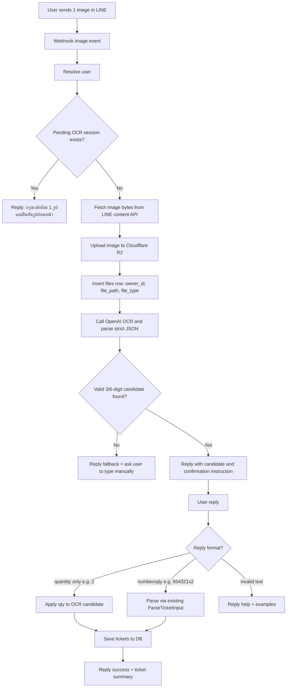

# T-020 — Photo Ticket Capture (LINE Image → OpenAI OCR → Confirm → Save)

**Task:** T-020 (proposed)
**Status:** draft (idea stage)
**Priority:** post-MVP candidate
**Date:** 2026-05-12
**Source references:**
- `doc/00-source/versions/v0.2/01-prd.md` §3.2, §8 (OCR currently out of scope)
- `doc/00-source/versions/v0.2/01-prd.md` §6.1 (LINE Messaging API)
- `doc/00-source/versions/v0.2/01-prd.md` §7 (reliability/security)
- `trunk/glo_result.json` (result format reference for later matching flow)

---

## Problem / Opportunity

Users currently must type ticket numbers manually. This is friction-heavy and error-prone.

Proposed feature: users send ticket photos in LINE chat; backend extracts candidate lottery numbers with OpenAI, asks user to confirm number + quantity, then saves tickets using the existing ticket flow.

---

## Proposed User Flow (MVP draft)

1. User sends **image message** in LINE chat.
2. Backend receives LINE `message` event (`type=image`).
3. Backend fetches image bytes from LINE content API.
4. Backend uploads image to Cloudflare R2 and stores file metadata/path in `files` table.
5. Backend calls OpenAI with prompt + image reference and requests strict JSON output.
6. Backend replies with extracted candidates and asks user to confirm in text (example: `123456x2 789x1`).
7. User sends confirmation text.
8. Existing text parser (`ParseTicketInput`) + save flow persists tickets into `tickets` as today.

### Flow Graphic (draft)

---

## Scope Proposal

### In scope (first iteration)

- Accept LINE image messages in webhook handler.
- **Single-image flow only** (one pending OCR-confirmation session per user at a time).
- Upload original image to R2.
- Persist image path in `files` table.
- OCR extraction through OpenAI response in JSON format.
- Chat confirmation step before DB ticket insert.
- Fallback response when OCR confidence is low or no valid number found.

### Out of scope (first iteration)

- Auto-save without user confirmation.
- Multi-image batch session management (deferred: higher complexity in state, idempotency, UX, and OCR cost control).
- Advanced image preprocessing pipeline.
- Admin moderation dashboard.
- OCR cost optimization beyond basic guardrails.

---

## Technical Design Notes (draft)

### A) LINE image handling

- Extend handler routing for `webhook.ImageMessageContent`.
- Fetch binary content using LINE Messaging API content endpoint.
- Enforce one-image-only guardrail for MVP: if user sends additional image(s) before confirming the pending OCR result, reply with guidance (e.g. `กรุณาส่งทีละ 1 รูป`) and do not start a parallel OCR session.
- Keep webhook response latency bounded; long operations should not block response path.

### B) Cloudflare R2 storage

- Upload with deterministic key convention, e.g. `line/{line_user_id}/{yyyy}/{mm}/{uuid}.jpg`.
- Store metadata in `files` table:
  - `owner_id` = resolved `users.id`
  - `file_path` = R2 key (or full object URL policy-defined)
  - `file_type` = `image/jpeg` (or detected MIME)
- If object is private, create short-lived signed URL for OCR call.

### C) OpenAI extraction

- Send image + strict prompt:
  - extract only Thai lottery-relevant numbers
  - normalize into JSON array
  - include confidence hints
- Expected internal output shape (example):
  - `{ candidates: [{ number: "123456", type: "L6", confidence: 0.93 }], raw_text: "..." }`
- Only 3-digit and 6-digit candidates should be considered valid for ticket save.

### D) Confirmation UX

- Bot reply template (draft):
  - "พบเลขที่เป็นไปได้: 123456\nถ้าถูกต้อง พิมพ์จำนวนอย่างเดียว เช่น 2\nถ้าไม่ถูกต้อง พิมพ์เลขพร้อมจำนวน เช่น 654321x2"
- Confirmation input rule (draft):
  - If user trusts OCR number: reply with quantity only (e.g. `2`) and system applies it to extracted number.
  - If user wants correction: reply using existing command style (e.g. `654321x2` or `654321x2 789x1`).
- Reuse current `ParseTicketInput` for correction path to minimize new parsing logic.
- If user sends unrelated text, return help + examples.

### E) Idempotency and reliability

- Keep webhook event idempotency via existing `webhook_events` table.
- Add retry/backoff for OpenAI and R2 transient failures.
- Ensure failures do not crash handler; log with request ID and actionable tags.

---

## Security / Compliance Notes

- Never hardcode API keys.
- New secrets likely needed:
  - `OPENAI_API_KEY`
  - `R2_ACCOUNT_ID`
  - `R2_ACCESS_KEY_ID`
  - `R2_SECRET_ACCESS_KEY`
  - `R2_BUCKET`
  - `R2_PUBLIC_BASE_URL` (optional) or signed URL strategy
- Avoid logging user image content or full OCR raw text containing PII-like patterns.

---

## Decisions (current draft)

1. **Timing:** Implement this feature before LIFF planning/implementation (T-009).
2. **Storage policy:** Keep the original image and generate a compressed derivative for efficiency, while preserving sufficient quality for future LIFF UI usage.
3. **Retention target:** 1 year (subject to final infra/cost policy).
4. **Confirmation session model (v1):** Plain text confirmation is sufficient for MVP; no dedicated pending-session table in v1.

## Remaining Open Question

1. **Cost control:** Per-user/day rate limit and max image size are still under consideration; currently treated as a paid-feature control area.

---

## Suggested Delivery Plan

1. `design_validate` (finalize prompt format, R2 URL strategy, confirmation contract)
2. Implement storage + OCR client adapters
3. Implement image event handler and confirmation prompts
4. Integrate with existing ticket submission flow
5. Add tests (unit + manual chat flow checks)
6. Roll out behind feature flag if needed

---

## Success Criteria (draft)

- User can send a ticket photo and receive extracted candidates within acceptable chat latency.
- User can confirm via text and tickets are stored correctly in `tickets`.
- Image path is stored in `files` and object exists in R2.
- Duplicate webhook deliveries do not create duplicate side effects.
- Errors produce clear user-facing fallback message and useful backend logs.
